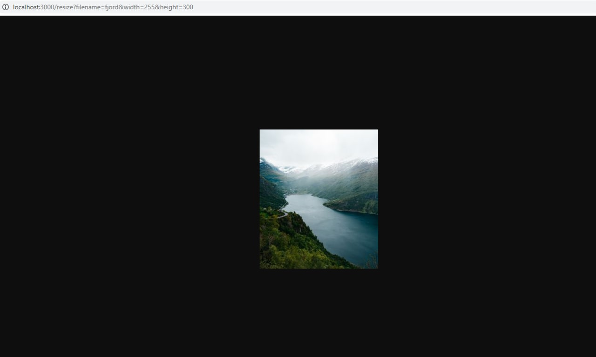

# Image-Processing-API

This project is an API that allows you to place images into your frontend with the size set via URL parameters and serve properly scaled versions of your images to reduce page load size. It is built with Node.js and uses best practices such as TypeScript, unit testing, linting, and formatting to ensure scalable and maintainable code. The API can be used for rapid prototyping or as a library for serving stored images in various sizes. It provides the building blocks for handling image processing in an enterprise-level solution.

## Table of Contents

- [Getting Started](#getting-started)
- [Installation](#installation)
- [Dependencies](#dependencies)
- [Usage Documentation](#usage-documentation)

## Getting Started

To get started with this project, follow these steps:

1. Make sure that you have Node.js and npm installed on your system. If you don't already have them, you can download and install them from the official Node.js website 

    (https://nodejs.org/)

2. Clone the repository:

   `git clone https://github.com/RogerA11/Image-Processing-API.git`
3. Navigate to the root directory of the project:

   `cd Image-Processing-API`

## Installation

1. Open a terminal window and navigate to the root directory of your project.
2. Run the following command to install the dependencies listed in the package.json file:

   `npm install`

This will install all the packages listed in the `dependencies` and `devDependencies` sections of the `package.json` file. The packages will be downloaded from npm and placed in a `node_modules` directory within the project.

## Dependencies

These packages are required to run the project.

- `express`: A web framework for Node.js
- `sharp`: An image processing library
- `supertest`: A library for testing HTTP APIs
- `typescript`: A typed superset of JavaScript

Installation example:

1. Open a terminal window and navigate to the root directory of your project.
2. Run the following command.

   `npm i express`

The `devDependencies` section in the `package.json` script lists the packages that are used for development purposes.

## Usage Documentation

Instructions for using the project.

1. To run the project, open the terminal and use the `start` script:

   `npm run start` 

   or  
   
   `node build/main`

2. Follow the given link:

   `http://localhost:3000`

3. Navigate to the resize API and include arguments for relevant query parameters, like the example below:

   `http://localhost:3000/resize?filename=fjord&width=255&height=300`

   - filename argument can include: 
     
      ['encenadaport', 'fjord', 'icelandwaterfall', 'palmtunnel', 'santamonica']

   - Both width and height arguments can not be negative.

4. Running the response in the browser should give you an output with the processed image like the one below:

   

5. This resized image will be stored in the `/assets/thumb` directory as fjord_255_300_thumb.jpg

Other scripts that are available include:

- `format`: Formats the code using Prettier
- `lint`: Lints the code using ESLint
- `jasmine`: Runs the Jasmine tests
- `build`: Transpiles the TypeScript code into JavaScript
- `test`: Builds the code and runs the Jasmine tests

Running script example:

1. Open a terminal window and navigate to the root directory of your project.
2. Run the following command.

   `npm run format`

